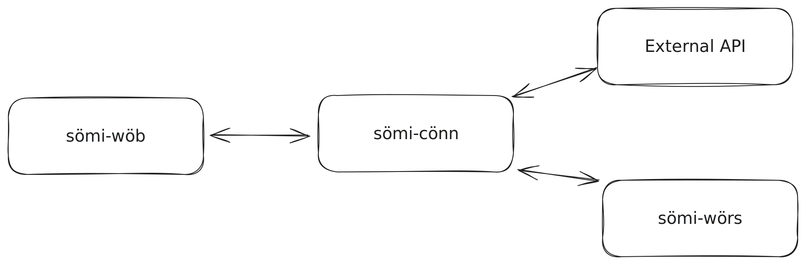

# Sömi Weather

Camünda gold

## Some words by the authors

So basically this entire project was a mistake.

### Some more words by the authors

Apart from that: It has (had depending on the time you're reading this) a fully functional AKS cluster in the Azure
cloud (as implied by the name **A**zure **K**ubernetes **S**ervice...), a really fancy fully functional and perfect
React web app (done in javascript obv.), a really nice and well planned and implemented ktor backend and [...] did we
forget to mention anything?

> Oh, right. We did forget to mention something: This entire project is a dedicated joke on camunda, as we both very
> much dislike it. So what better way to joke on a project we were forced to implement in camunda than to just make the
> entire project _not_ about camunda at all! (Great humour and funny joke, we know).
